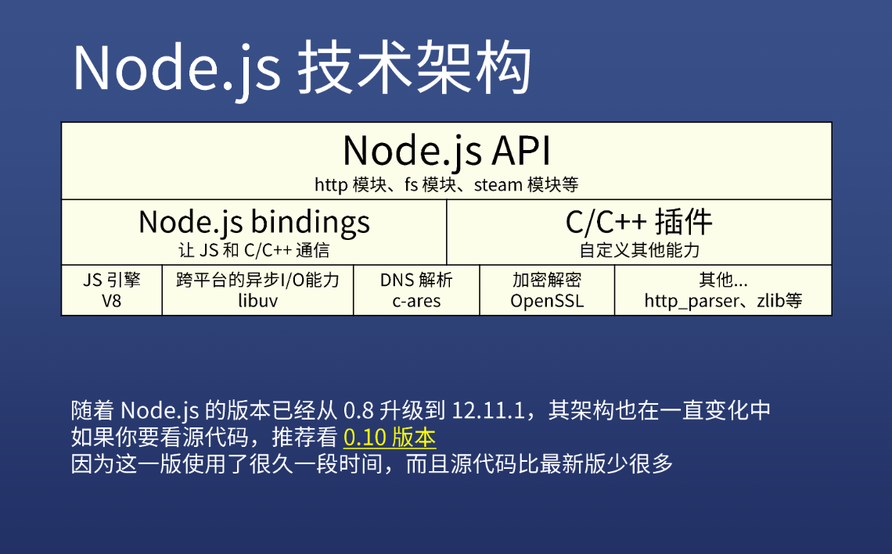
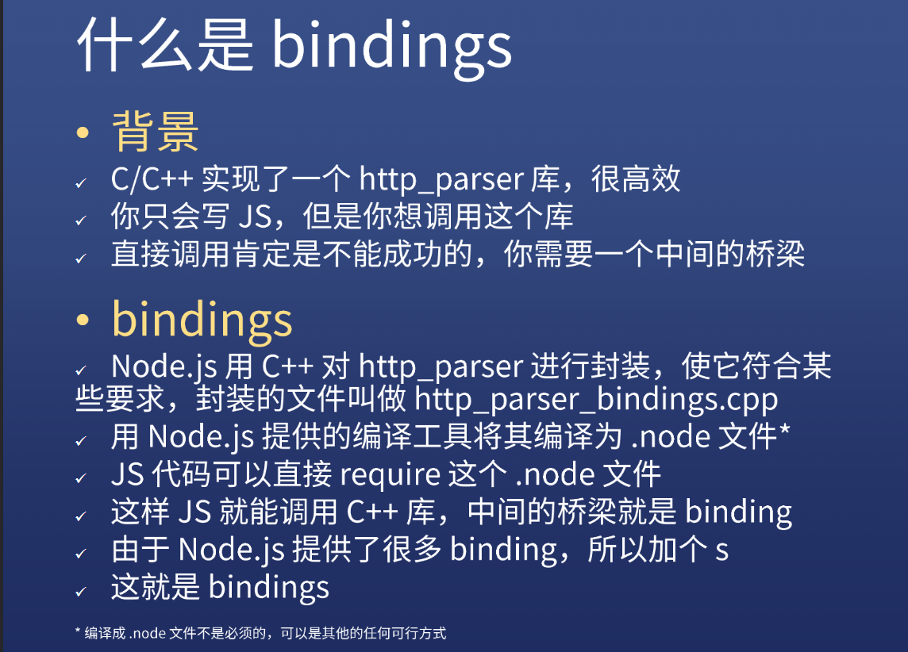
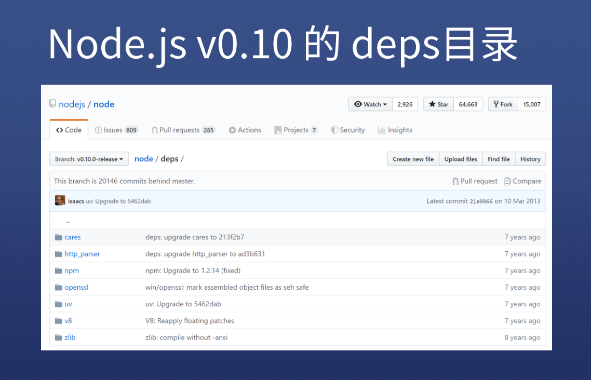
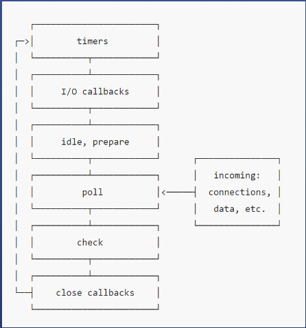
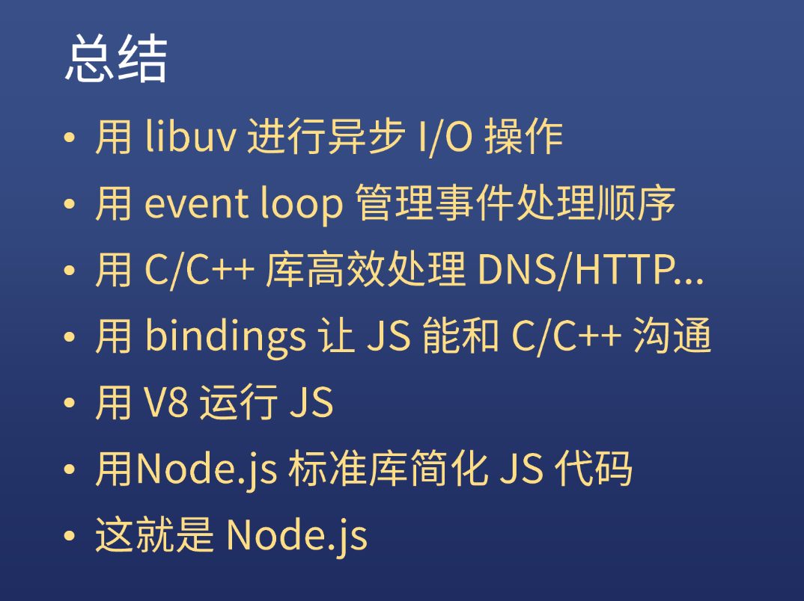
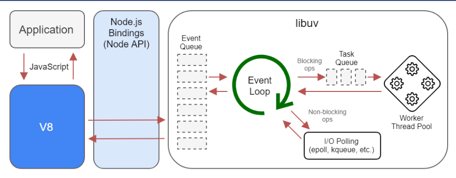

# Node.js 认识和技术结构简介

## 认识

### nodejs不是什么

1.不是编程语言

​	不是后端的js，不能把Node.js与Python或PHP对比

2.不是web后端框架

​	和python的flask以及和java的spring不是一类东西

### nodejs是什么

是平台

​	是一个**多种技术**结合在一起的平台，使其能够**使用JavaScript调用系统接口**，开发后端应用

​	

### nodejs用到哪些技术

+ V8引擎

+ libuv

+ C/C++实现的一些库（c-ares, http-parser, OpenSSL, zlib）

### 其他

双数是稳定版本，单数是非稳定版本

## 安装

常规安装

其他：

版本管理  nvm

切换下载源 nrm

ts-node 可以运行ts的node

## 技术架构

### 总体架构

### bindings

### JS和C/C++的相互调用

JS可以调用C/C++	例子：

[JS调用C/C++](http://nodejs.cn/api/addons.html#addons_function_arguments)

C/C++也可以调用JS	例子：

[C/C++调用JS](http://nodejs.cn/api/addons.html#addons_callbacks)

### deps

node的依赖（下面是C++的库）

主要要知道的是UV和V8

## libuv

C/C++的库

一个**跨平台**（linux,windows,mac等都有自己的异步IO的方式，不想为每一个系统写一套，所以写了一个跨平台的库，会根据系统自动选择合适方案）的**异步I/O库**

作用：用于TCP/UDP/DNS/文件等的异步操作

这个库封装了一系列I/O的API给JS调用

## V8

功能：

+ 将JS源代码变成本地代码（可以理解为机器码01）并执行
+ 维护调用栈，确保JS函数的执行顺序
+ 内存管理，为所有对象分配内存
+ 垃圾回收，重复利用无用的内存
+ 实现JS的标准库

注意：

+ V8不提供 DOM API (浏览器提供)
+ V8执行 JS 是单线程的
+ 可以开启两个线程分别执行 JS   是否是webworker
+ V8本身是包含多个线程的，如垃圾回收为单独线程
+ 自带event loop但是Nodejs基于libuv自己做了一个

## event loop

Nodejs基于libuv自己做了一个 event loop

event loop翻译过来就是**事件循环**

决定事件的执行顺序：

比如

+ setTimeout(f1,100)
+ fs.readFile('/1.txt',f2)
+ server.on('close',f3)

如果上面3个事件同时触发，请问回调函数的执行顺序是怎么样的

答案：

node会循环上面的阶段

重点阶段：

+ timers检查计时器
+ poll轮询，检查系统事件（文件，网络请求）
+ check检查setImmediate回调
+ 其他阶段一般不看

注意：

+ 大部分时间，node都会停留在poll轮询阶段(大部分事件都在poll阶段被处理，如文件，网络)，直到setTimeout时间到了或者check阶段setImmediate触发

  

区别浏览器的event loop：

浏览器的是v8自带的，只分异步队列（宏队列（setTimeout和setInterval）和微队列（promise））和同步代码

## 总结

一句话：各司其职

图解：

从这张图我们也可以看出，node.js并不是一门语言，他只是一个平台

学习建议：

大部分的时候，我们只需要学习Node.js的标准库即可

等学会熟练运用标准库的API之后，可以进一步学习C/C++了解更多标准库以外的东西

