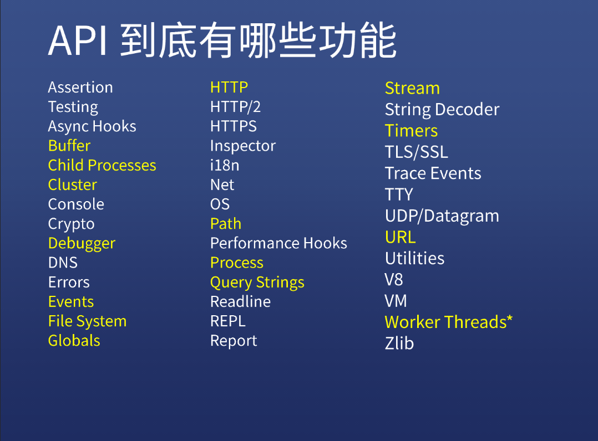

# API概述

## 通览

## 各个API

### 黄色 ( 重要 )

+ Buffer 就是一小段缓存  用处：比如利用HTTP请求上传一个文件，文件是一点一点上传的
+ Child Processes    子进程 可以理解为2个node.js或者2个v8，同时处理2件事
+ Cluster 把多个node.js综合到一起，他们的关系就是你是主要的，我是次要的
+ Events  设计模式里面的**发布订阅模式**   其实就是手写EventHub    有on off emit三个事件
+ File System 文件和目录的增删改查
+ Globals  全局变量
  + `__dirname` 当前文件所在目录
  + `__filename` 当前文件的文件名
  + 其他：`console`, `exports`, `global`, `module`, `process`, `require()`, `setTimeout`, `setImmediate`等
+ HTTP HTTP2 HTTPS
+ Path
+ Process
+ Query Strings
+ Stream 流格式
+ Timers   1.setTimeout  2.setImmediate  3.setInterval
+ URL 

### 白色（不重要）

基本不会用到 大概知道干嘛的就行

+ Assertion  断言  测试代码的工具   

+ Testing 测试

+ Async Hooks 异步钩子

+ console 控制台
+ Crypto 做加密的
+ DNS DNS解析
+ Errors   错误类型
+ 其他...

